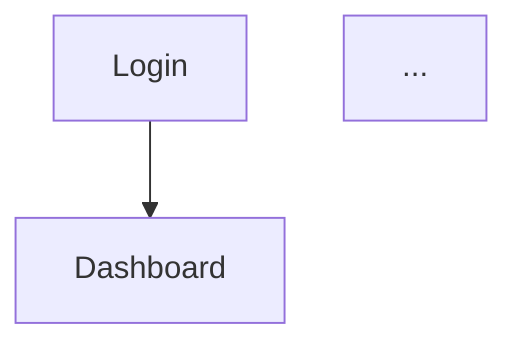

# UI Mockup

Web画面を含むアプリケーションのUIモックアップを生成します。

## 目的
- 要件定義前に画面イメージを視覚化し、認識齟齬を防止
- ユーザーストーリーの具体的なイメージを提供
- 早期のUI/UXフィードバック収集を可能に

## 実行条件

**Execute IF**:
- Web UI / フロントエンド画面を含むアプリケーション
- ユーザーが明示的にUI設計を要求

**Skip IF**:
- API only
- バッチ処理
- CLI
- バックエンドのみ

## 配置位置
- Reverse Engineering後、Requirements Analysis前
- 理由: 要件定義を行う際に画面イメージがあると、要件の認識齟齬を防げる

## Greenfield vs Brownfield

### Greenfield（新規プロジェクト）の場合
- ユーザーリクエストから画面一覧を抽出
- ゼロから画面設計・モックアップを作成

### Brownfield（既存プロジェクト）の場合
1. **既存UI参照ファイルの特定**
   - Reverse Engineeringの結果から既存UIファイルを特定
   - フロントエンドコード（React、Vue、HTML等）を分析
2. **ユーザー確認（MANDATORY）**
   - モックアップ作成前に、参考とする既存UIファイルの一覧をユーザーに提示
   - ユーザーが参照ファイルが正しいことを確認するまで進行しない
3. **既存UIベースのモックアップ作成**
   - 既存UIの構造・デザインを踏襲
   - 変更・追加部分を明示

## 2パート構成

### Part 1: Planning
1. コンテキスト分析
2. 【Brownfieldのみ】既存UI参照ファイルのユーザー確認
3. 画面一覧の抽出
4. 画面遷移図の作成
5. モックアップ生成プラン作成
6. ユーザーレビュー・承認

### Part 2: Generation
1. 承認済みPlanの実行
2. モックアップコード生成
3. 成果物レビュー・ユーザー承認

## 生成する成果物

| 場所 | ファイル | 内容 |
|------|---------|------|
| aidlc-docs/inception/plans/ | ui-mockup-plan.md | モックアップ生成プラン |
| aidlc-docs/inception/ui-mockup/ | existing-ui-reference.md | 既存UI参照ファイル一覧（Brownfieldのみ） |
| aidlc-docs/inception/ui-mockup/ | screen-inventory.md | 画面一覧・遷移図 |
| aidlc-docs/inception/ui-mockup/ | wireframes.md | ワイヤーフレーム説明 |
| mockups/ | *.tsx / *.html | React/HTML プロトタイプコード |

## 実行手順概要

### Part 1: Planning

#### Step 1: コンテキスト分析
- Greenfield: ユーザーリクエストの読み込み
- Brownfield: Reverse Engineering結果の読み込み、既存UIファイルの特定

#### Step 2: Planドキュメント作成 (MANDATORY)

**必須**: 質問や確認をチャットで行わず、先に `aidlc-docs/inception/plans/ui-mockup-plan.md` を作成する

Planドキュメントの構造:

```markdown
# UI Mockup Plan

## 1. コンテキスト分析
- プロジェクトタイプ: [Greenfield/Brownfield]
- ユーザーリクエストサマリー: [...]
- 技術スタック: [React/Vue/HTML等]

## 2. 明確化質問（必要な場合）

### [Q1] 画面のデザインスタイル
**質問の背景**: モックアップのデザイン方針を決定するため
- A) シンプル・ミニマル（推奨）
- B) モダン・フラット
- C) 既存デザインに合わせる
[Answer]: _______

### [Q2] ...

## 3. 既存UI参照ファイル（Brownfieldのみ）

**検出された既存UIファイル:**
- [ ] `src/components/Header.tsx`
- [ ] `src/pages/Dashboard.tsx`
- ...

> 上記ファイルで正しいですか？追加・除外があれば指示してください。

## 4. 画面一覧（計画）

| 画面名 | 目的 | 主要要素 |
|--------|------|----------|
| ログイン | ユーザー認証 | フォーム, ボタン |
| ダッシュボード | メイン操作 | サイドバー, カード |
| ... | ... | ... |

## 5. 画面遷移図



## 6. モックアップ生成ステップ

- [ ] Step 1: 共通コンポーネント生成
- [ ] Step 2: ログイン画面生成
- [ ] Step 3: ダッシュボード画面生成
- [ ] Step 4: ...
- [ ] Step 5: 起動環境セットアップ
- [ ] Step 6: ドキュメント生成
```

#### Step 3: ユーザーレビュー依頼

Planドキュメント作成後、ユーザーにレビューを依頼:

```markdown
# 📋 UI Mockup Plan - Review Required

UIモックアップの生成プランを作成しました。

> **📋 <u>**REVIEW REQUIRED:**</u>**  
> Please examine: `aidlc-docs/inception/plans/ui-mockup-plan.md`
>
> 質問がある場合は、Planドキュメント内の「明確化質問」セクションに回答してください。

> **🚀 <u>**WHAT'S NEXT?**</u>**
>
> 🔧 **修正依頼** - プランの修正を依頼
> ✅ **承認** - モックアップ生成に進む
```

**注意**: ユーザーが「✅ 承認」を選択するまで Part 2 に進まない

### Part 2: Generation

#### Step 4-7: プラン実行、モックアップ生成

#### Step 8: 起動環境セットアップと起動方法説明 (MANDATORY)

**必須**: モックアップコード生成後、以下を必ず実施：

1. **環境セットアップの実行**
   - `npm install` または必要な依存関係のインストール
   - `package.json` が存在しない場合は作成

2. **起動確認とURL取得**
   - 実際に `npm run dev` を実行
   - ターミナル出力から実際のポート番号を確認（デフォルト: 5173、使用中なら5174, 5175...）
   - エラーがないことを確認

3. **起動方法の説明**
   - 実際のポート番号を記載（ターミナル出力から取得）
   - 起動URLをユーザーに提示

#### Step 8.5: 上流ドキュメントフィードバック更新

[upstream-document-update.md](references/upstream-document-update.md) のルールに従い、前段階ドキュメントを最新化する。

> **本ステージの更新対象**: 該当なし（上流ドキュメントが存在しないため）

#### Step 9: 完了メッセージ（ユーザー承認待ち - MANDATORY）

**CRITICAL**: 自動で次フェーズに進まず、必ずユーザー承認を待つ

```markdown
# 🎨 UI Mockup Complete

[AI-generated summary]

**Generated Artifacts:**
- ✅ screen-inventory.md
- ✅ wireframes.md
- ✅ mockups/[files]

## 🚀 モックアップ起動方法

```bash
cd mockups
npm install
npm run dev
```

ブラウザで http://localhost:[**実際のポート番号**] を開いてください。

> ※ ポート番号はターミナル出力で確認してください（デフォルト: 5173）

---

> **📋 <u>**REVIEW REQUIRED:**</u>**  
> Please examine: 
> - `aidlc-docs/inception/ui-mockup/`
> - `mockups/`
> - 実際にモックアップを起動して画面を確認してください

> **🚀 <u>**WHAT'S NEXT?**</u>**
>
> 🔧 **修正依頼** - モックアップの修正を依頼
> ✅ **承認** - **Requirements Analysis** に進む
```

**注意**: ユーザーが「✅ 承認」を明示的に選択するまで、次のフェーズに進んではならない。

## 参照ドキュメント

- [詳細手順](references/detailed-steps.md)

### 共通ルール
- [質問フォーマットガイド](../aidlc-core/references/question-format.md)
- [過信防止ガイド](../aidlc-core/references/overconfidence.md)

