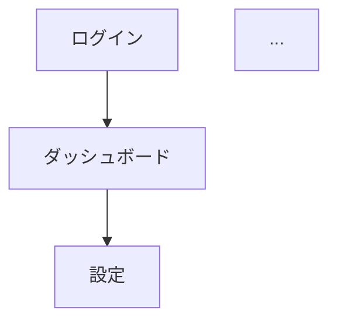

# UI Mockup - 詳細手順

## Part 1: Planning

### Step 1: コンテキスト分析

#### Greenfield
1. ユーザーリクエストを読み込み
2. 画面が必要な機能を特定
3. 想定されるユーザーフローを分析

#### Brownfield
1. `aidlc-docs/inception/reverse-engineering/` を読み込み
2. 既存のフロントエンドファイルを特定:
   - React: `*.tsx`, `*.jsx`, `components/`, `pages/`
   - Vue: `*.vue`, `components/`, `views/`
   - Angular: `*.component.ts`, `*.component.html`
   - HTML: `*.html`, `templates/`
3. 既存UIの構造を分析

### Step 2: Planドキュメント作成 (MANDATORY)

**CRITICAL**: 質問や確認をチャットで行わず、先に `aidlc-docs/inception/plans/ui-mockup-plan.md` を作成する

#### Planドキュメントのテンプレート

```markdown
# UI Mockup Plan

## 1. コンテキスト分析

### プロジェクト情報
- プロジェクトタイプ: [Greenfield/Brownfield]
- ユーザーリクエストサマリー: [要約]
- 技術スタック: [React/Vue/HTML等]

### 分析結果
[コンテキスト分析の結果を記載]

## 2. 明確化質問（必要な場合）

> **注意**: 以下の質問に回答してください。不明な点があれば追記してください。

### [Q1] 画面のデザインスタイル
**質問の背景**: モックアップのデザイン方針を決定するため
**選択肢**:
- A) シンプル・ミニマル（推奨）
- B) モダン・フラット
- C) 既存デザインに合わせる（Brownfieldの場合）
[Answer]: _______

### [Q2] 必要な画面の確認
**質問の背景**: 生成する画面の漏れを防ぐため
**提案される画面一覧**:
- ログイン画面
- ダッシュボード
- [他の画面...]
[Answer]: 上記で問題ありません / 追加: ______ / 削除: ______

### [Q3] [追加の質問があれば...]
...

## 3. 既存UI参照ファイル（Brownfieldのみ）

**検出された既存UIファイル:**
- [ ] `src/components/Header.tsx` - ヘッダーコンポーネント
- [ ] `src/pages/Dashboard.tsx` - ダッシュボード画面
- [ ] ...

> 上記ファイルで正しいですか？追加・除外があれば指示してください。
[Answer]: _______

## 4. 画面一覧（計画）

| # | 画面名 | 目的 | 主要要素 |
|---|--------|------|----------|
| 1 | ログイン | ユーザー認証 | フォーム, ボタン |
| 2 | ダッシュボード | メイン操作 | サイドバー, カード |
| 3 | ... | ... | ... |

## 5. 画面遷移図



## 6. モックアップ生成ステップ

- [ ] Step 1: 共通コンポーネント生成（Header, Footer, Navigation等）
- [ ] Step 2: ログイン画面生成
- [ ] Step 3: ダッシュボード画面生成
- [ ] Step 4: [他の画面...]
- [ ] Step 5: 起動環境セットアップ（package.json, npm install）
- [ ] Step 6: 起動確認・URL取得
- [ ] Step 7: ドキュメント生成（screen-inventory.md, wireframes.md）
```

### Step 3: ユーザーレビュー依頼

Planドキュメント作成後、以下のメッセージでユーザーにレビューを依頼:

```markdown
# 📋 UI Mockup Plan - Review Required

UIモックアップの生成プランを作成しました。

> **📋 <u>**REVIEW REQUIRED:**</u>**  
> Please examine: `aidlc-docs/inception/plans/ui-mockup-plan.md`
>
> **確認事項:**
> - 質問がある場合は、Planドキュメント内の「明確化質問」セクションに回答してください
> - 画面一覧・遷移図に問題がないか確認してください
> - 生成ステップに過不足がないか確認してください

> **🚀 <u>**WHAT'S NEXT?**</u>**
>
> 🔧 **修正依頼** - プランの修正を依頼
> ✅ **承認** - モックアップ生成に進む
```

### Step 4: ユーザー承認待ち

**MANDATORY**: ユーザーが「✅ 承認」を選択するまで Part 2 に進まない

- 「🔧 修正依頼」の場合: Planドキュメントを更新し、再度 Step 3 を実行
- 「✅ 承認」の場合: Part 2 に進む
---

## Part 2: Generation

### Step 5: 承認済みPlanのロード

`ui-mockup-plan.md` を読み込み、次の未完了ステップを特定

### Step 6: モックアップ生成実行

#### 共通コンポーネント生成
```
mockups/
├── components/
│   ├── Header.tsx (or .html)
│   ├── Footer.tsx
│   ├── Navigation.tsx
│   └── Layout.tsx
```

#### 画面モックアップ生成
```
mockups/
├── pages/
│   ├── Login.tsx
│   ├── Dashboard.tsx
│   ├── Settings.tsx
│   └── ...
```

#### Brownfield特有のルール
- 既存UIの構造・スタイルを踏襲
- 変更部分には `{/* CHANGED: 説明 */}` コメントを追加
- 新規部分には `{/* NEW: 説明 */}` コメントを追加

### Step 7: 成果物の保存

1. `aidlc-docs/inception/ui-mockup/screen-inventory.md`
   - 画面一覧
   - 画面遷移図（Mermaid）
   - 各画面の説明

2. `aidlc-docs/inception/ui-mockup/wireframes.md`
   - ワイヤーフレーム説明
   - レイアウト構造
   - 主要コンポーネント配置

3. `aidlc-docs/inception/ui-mockup/existing-ui-reference.md` (Brownfieldのみ)
   - 参照した既存UIファイル一覧
   - 既存UIの分析結果

4. `mockups/` ディレクトリ
   - React/HTMLプロトタイプコード

### Step 8: 起動環境セットアップと起動方法説明 (MANDATORY)

**必須**: このステップは省略不可

#### 8.1 環境セットアップの実行

1. `mockups/` ディレクトリに必要なファイルが揃っていることを確認
2. `package.json` が存在しない場合は作成:
   ```json
   {
     "name": "ui-mockups",
     "private": true,
     "version": "0.0.0",
     "type": "module",
     "scripts": {
       "dev": "vite",
       "build": "vite build",
       "preview": "vite preview"
     },
     "dependencies": {
       "react": "^18.2.0",
       "react-dom": "^18.2.0",
       "react-router-dom": "^6.0.0"
     },
     "devDependencies": {
       "@types/react": "^18.2.0",
       "@types/react-dom": "^18.2.0",
       "@vitejs/plugin-react": "^4.0.0",
       "typescript": "^5.0.0",
       "vite": "^5.0.0"
     }
   }
   ```
3. 依存関係のインストール: `npm install`

#### 8.2 起動確認とURL取得

1. 開発サーバー起動: `npm run dev`
2. エラーがないことを確認
3. **ターミナル出力から実際のポート番号を取得**
   - デフォルト: 5173
   - ポート使用中の場合: 5174, 5175... と自動変更
   - Vite出力例: `Local: http://localhost:5174/`

#### 8.3 起動方法をユーザーに説明

完了メッセージに以下を含める（**実際のポート番号を記載**）:
```markdown
## 🚀 モックアップ起動方法

```bash
cd mockups
npm install
npm run dev
```

ブラウザで http://localhost:[**実際のポート番号**] を開いてください。
```

### Step 9: 完了メッセージ・ユーザー承認依頼 (MANDATORY)

**CRITICAL**: 自動で次フェーズに進まず、必ずユーザー承認を待つ

以下の形式で完了メッセージを表示:

```markdown
# 🎨 UI Mockup Complete

[生成した成果物のサマリー]

**Generated Artifacts:**
- ✅ screen-inventory.md
- ✅ wireframes.md
- ✅ mockups/[files]

## 🚀 モックアップ起動方法

```bash
cd mockups
npm install
npm run dev
```

ブラウザで http://localhost:[**実際のポート番号**] を開いてください。

> ※ ポート番号はターミナル出力で確認してください（デフォルト: 5173）

---

> **📋 <u>**REVIEW REQUIRED:**</u>**  
> Please examine: 
> - `aidlc-docs/inception/ui-mockup/`
> - `mockups/`
> - 実際にモックアップを起動して画面を確認してください

> **🚀 <u>**WHAT'S NEXT?**</u>**
>
> 🔧 **修正依頼** - モックアップの修正を依頼
> ✅ **承認** - **Requirements Analysis** に進む
```

### Step 10: ユーザー承認待ち（フェーズ完了確認）

**MANDATORY**: ユーザーが「✅ 承認」を明示的に選択するまで、次のフェーズに進んではならない

- 「🔧 修正依頼」の場合: 修正を実施し、再度 Step 9 を実行
- 「✅ 承認」の場合: Step 11 に進む

### Step 11: 状態更新・監査ログ記録

1. `aidlc-state.md` を更新
2. `audit.md` にログを追記
3. Plan内のチェックボックスを全て [x] に更新
