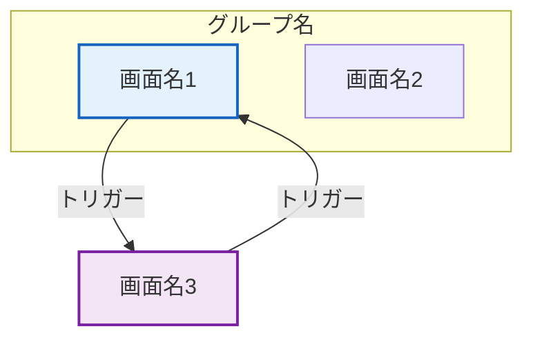

# 出力ドキュメントフォーマット仕様

画面遷移ドキュメント（Markdown / DOCX）の標準セクション構成・テーブル定義・Mermaid図ルール。

---

## ドキュメント構成

| セクション | 内容 | 必須 |
|-----------|------|------|
| 1. 画面遷移図 | Mermaid形式の遷移図 | ✅ |
| 2. 画面URL一覧 | 全画面のURL・認証要件 | ✅ |
| 3. 全機能一覧 | 画面別の提供機能一覧 | ✅ |
| 4. 画面-API紐付け | 画面が呼び出すAPI一覧 | ✅ |
| 5. 画面遷移テーブル | 遷移元→遷移先とトリガー | ✅ |
| 6. 画面別詳細 | スクリーンショット + 機能 + API | ✅ |

---

## セクション 1: 画面遷移図

### Mermaid記法ルール



### スタイル分類

| クラス名 | 対象 | 色 |
|---------|------|------|
| `authPage` | 認証前画面（`screenshotBeforeAuth: true`） | 青系（#e3f2fd / #1565c0） |
| `normalPage` | 通常画面 | 紫系（#f3e5f5 / #7b1fa2） |
| `adminPage` | 管理者画面（`requiresAdmin: true`） | オレンジ系（#fff3e0 / #e65100） |

### サブグラフルール

- 同一URLパスで複数タブ/ビューを持つ画面群はサブグラフでグルーピング
- サブグラフ名は画面名の共通部分（例: `RI/SP分析`）
- サブグラフ内の遷移（タブ切替）もサブグラフ外の遷移も通常の矢印で表現

---

## セクション 2: 画面URL一覧

### テーブル定義

| カラム | 内容 | 幅目安 |
|-------|------|--------|
| No. | 連番 | 5% |
| 画面名 | `screen.name` | 20% |
| URLパス | `screen.path`（コードフォーマット） | 20% |
| 認証 | 必要 / 不要 | 10% |
| 管理者 | 必要 / - | 10% |
| 説明 | `screen.description` | 35% |

### Markdown例

```markdown
| No. | 画面名 | URLパス | 認証 | 管理者 | 説明 |
|-----|--------|--------|------|--------|------|
| 1 | ログイン画面 | `/` | 不要 | - | 認証前のログイン画面 |
| 2 | コスト推移画面 | `/cost-trend` | 必要 | - | コスト推移をグラフ表示 |
```

---

## セクション 3: 全機能一覧

### テーブル定義

| カラム | 内容 |
|-------|------|
| 画面名 | `screen.name` |
| 機能 | `screen.features[]` を箇条書きまたはカンマ区切り |

### Markdown例（箇条書きスタイル）

```markdown
| 画面名 | 機能 |
|--------|------|
| コスト推移画面 | 月別コスト推移グラフ、サービス別コスト内訳 |
| ユーザー管理画面 | ユーザー一覧表示、ユーザー招待、ロール変更 |
```

---

## セクション 4: 画面-API紐付け

### テーブル定義

| カラム | 内容 |
|-------|------|
| 画面名 | `screen.name` |
| メソッド | `api.method` |
| APIパス | `api.path` |
| 説明 | `api.description` |
| 認証 | 必要 / 不要 |

### Markdown例

```markdown
| 画面名 | メソッド | APIパス | 説明 | 認証 |
|--------|---------|---------|------|------|
| コスト推移画面 | GET | `/api/cost-trend` | コスト推移データ取得 | 必要 |
| ユーザー管理画面 | GET | `/api/users` | ユーザー一覧取得 | 必要 |
| ユーザー管理画面 | POST | `/api/users/invite` | ユーザー招待 | 必要 |
```

---

## セクション 5: 画面遷移テーブル

### テーブル定義

| カラム | 内容 |
|-------|------|
| No. | 連番 |
| 遷移元 | `transition.from` に対応する画面名 |
| 遷移先 | `transition.to` に対応する画面名 |
| トリガー | `transition.trigger` |
| 説明 | `transition.description` |

### Markdown例

```markdown
| No. | 遷移元 | 遷移先 | トリガー | 説明 |
|-----|--------|--------|---------|------|
| 1 | ログイン画面 | コスト推移画面 | 認証処理 | Okta認証後にリダイレクト |
| 2 | コスト推移画面 | RI/SP分析 | サイドメニュー選択 | サイドバーから選択 |
```

---

## セクション 6: 画面別詳細

各画面ごとに以下のサブセクションを出力する。画面間にはページ区切り（DOCX: `PageBreak`）を挿入。

### サブセクション構成

```markdown
### 6.X 画面名

**パス**: `/url/path`
**説明**: 画面の説明文

#### スクリーンショット


*画像サイズ: 1440 x 900 (実寸: 1440 x 1069)*

#### 機能一覧

- 機能1の説明
- 機能2の説明

#### API一覧

| メソッド | パス | 説明 | 認証 |
|---------|------|------|------|
| GET | `/api/endpoint` | API説明 | 必要 |

##### パラメータ詳細（API別）

| パラメータ名 | 種別 | 説明 |
|-------------|------|------|
| period | query | 表示期間 |
| accountId | query | AWSアカウントID |
```

### 画像サイズ表記

- **画像サイズ**: `config.browser.viewport` の値（スクリーンショット取得時の設定値）
- **実寸**: `captureData.actualSize` の値（フルページスクリーンショットの実際のサイズ）
- DOCX出力時はドキュメント幅に合わせてアスペクト比を維持してリサイズ

### APIパラメータ詳細テーブル

各APIの `parameters` オブジェクト内の `path`, `query`, `body` を統合して1テーブルに出力:

| カラム | 内容 |
|-------|------|
| パラメータ名 | プロパティ名 |
| 種別 | `path` / `query` / `body` |
| 説明 | パラメータの説明 |

---

## DOCX固有の書式設定

### フォント・文字サイズ

| 要素 | フォント | サイズ |
|------|---------|--------|
| 見出し1 | Arial | 28pt |
| 見出し2 | Arial | 24pt |
| 見出し3 | Arial | 20pt |
| 本文 | Arial | 10pt (20 half-point) |
| テーブルセル | Arial | 10pt (20 half-point) |

### テーブルスタイル

| 要素 | 設定 |
|------|------|
| ヘッダー行背景 | `#1565C0`（青） |
| ヘッダー行文字色 | `#FFFFFF`（白） |
| 偶数行背景 | `#F5F5F5`（薄灰） |
| 奇数行背景 | なし（白） |
| テーブル幅 | 100% |
| ボーダー | `BorderStyle.SINGLE`, size: 1, color: 'CCCCCC' |

### ページ設定

| 項目 | 値 |
|------|-----|
| 用紙サイズ | A4 (11906 x 16838 twips) |
| マージン | 上下左右 1440 twips (約25mm) |
| ヘッダー | ドキュメントタイトル |
| フッター | ページ番号（中央揃え） |

### ページ区切り

- セクション間: `new Paragraph({ children: [new PageBreak()] })`
- 画面詳細の各画面間にもページ区切りを挿入

---

## ファイル命名規則

### スクリーンショット

```
screenshots/
  00-login.png
  01-cost-trend.png
  02-ri-sp-utilization.png
  03-ri-sp-simulation.png
  04-user-management.png
```

- 連番は2桁ゼロ埋め（`String(i).padStart(2, '0')`）
- ファイル名は `{連番}-{screen.id}.png`

### Mermaid図PNG

```
screenshots/screen-transition-diagram.png
```

### 出力ドキュメント

```
screen-transition.md     # Markdownドキュメント
screen-transition.docx   # DOCX（オプション）
capture-data.json        # キャプチャメタデータ
```
